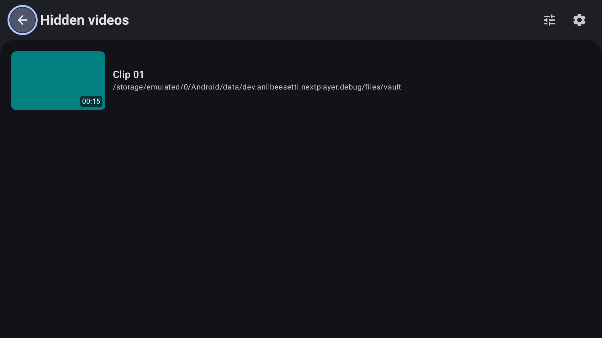
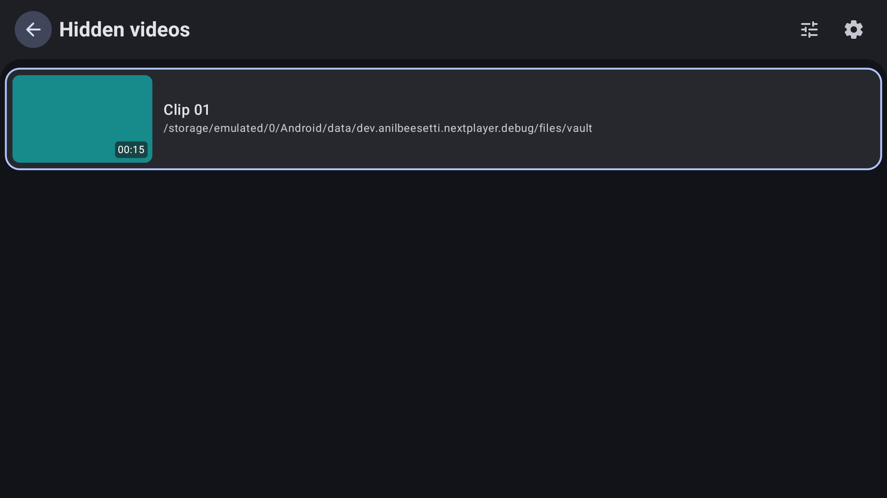
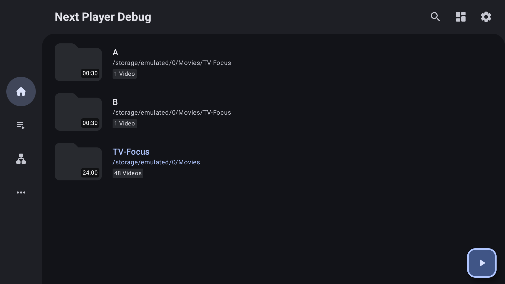

# TV focus verification

Verified September 10, 2026 on disposable Android TV emulators using API 36, ARM64, 1920 × 1080. Tests used generated local videos. The final preview emulator remains running for manual testing; the temporary playlist used for verification was removed.

## Behavior

- Shared content regions own initial focus and restoration across item updates, destination recreation, and return from playback. Stable item keys preserve the selected media item.
- TV text fields receive focus without opening the keyboard. D-pad Center, Enter, or numpad Enter starts editing; Back dismisses the keyboard, and D-pad navigation can then leave the field. Search results do not steal query focus.
- Home, Playlists, More, and Network FABs move Up into screen content. Network prefers the enabled Open network stream button, otherwise the URL field. Folder and playlist-detail Play FABs return to their media regions.
- Down traverses content before reaching the shared FAB; Left can still reach the navigation rail. Every FAB has a TV focus outline.

## Validation

JDK 17 and the checked-in Gradle wrapper:

```sh
./gradlew assembleDebug test ktlintCheck :app:assembleDebugAndroidTest
./gradlew :feature:playlist:assembleDebugAndroidTest
```

Both commands passed. Local JUnit XML contains 196 executions with zero failures, errors, or skips; XML was inspected independently because local test tasks ignore failures. Direct ktlint checks of changed Kotlin files and `git diff --check` also passed.

Final app instrumentation reported 31 tests OK in 91.145 seconds: 30 passed and one phone-only keyboard test skipped by assumption. The suites were `NavigationLayoutFabFocusTest`, `TopLevelFabFocusTest`, `NetworkFabFocusTest`, `TvMediaFocusTest`, `TvSettingsFocusTest`, and `NextOutlinedTextFieldTest`.

`PlaylistDetailScreenTest` passed all 12 tests in 18.56 seconds on the disposable TV. Total applicable TV device checks: **42 passed**.

The phone text-focus regression was also verified separately on a disposable Pixel 6a profile using the `android-37.1` ARM64 system image. That emulator was deleted afterward.

Manual D-pad checks covered Home traversal and FAB return, empty and populated Playlists, More history, Network button/URL routing, folder Play FAB return, selection actions, vault unlock/playback return, and search keyboard activation. Physical TVs and real network sources were not exercised.

The full app instrumentation suite has two known pre-existing incompatible cases: `MainActivityPermissionTest.api24RequestsReadStoragePermission` expects the older permission on API 36, and `MainActivityNavigationTest.vaultOpensAfterActivityRecreation` uses the removed app-title long-press shortcut. The targeted suites above passed.

## Screenshots

These captures use synthetic media only. The before/after pair shows return from vault playback before and after the restoration fix: focus previously landed on Back; it now returns to the played clip.

| Before restoration fix | After restoration fix |
| --- | --- |
|  |  |

Shared Home FAB with its TV focus outline:


